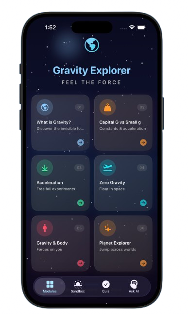
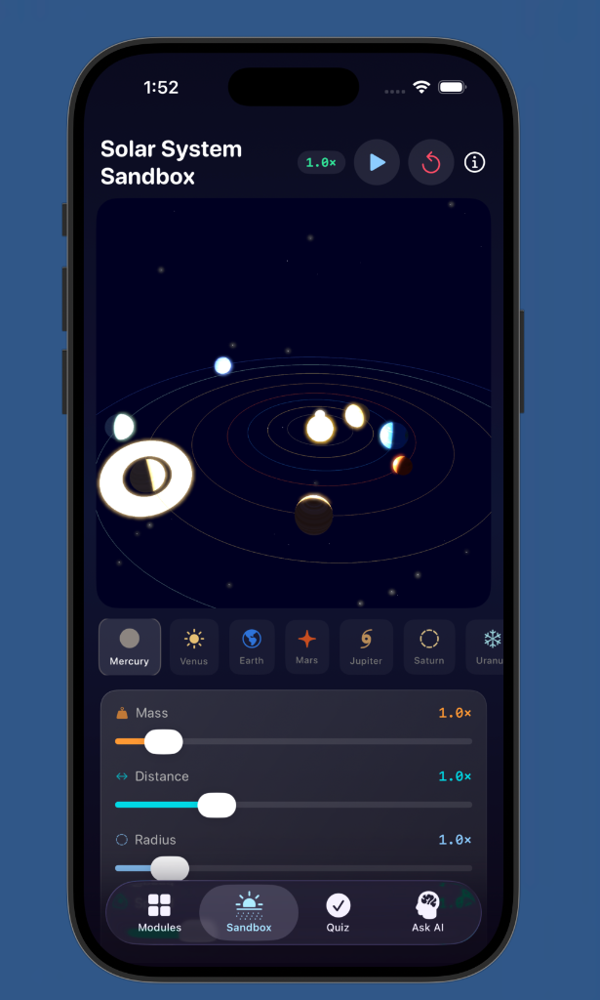
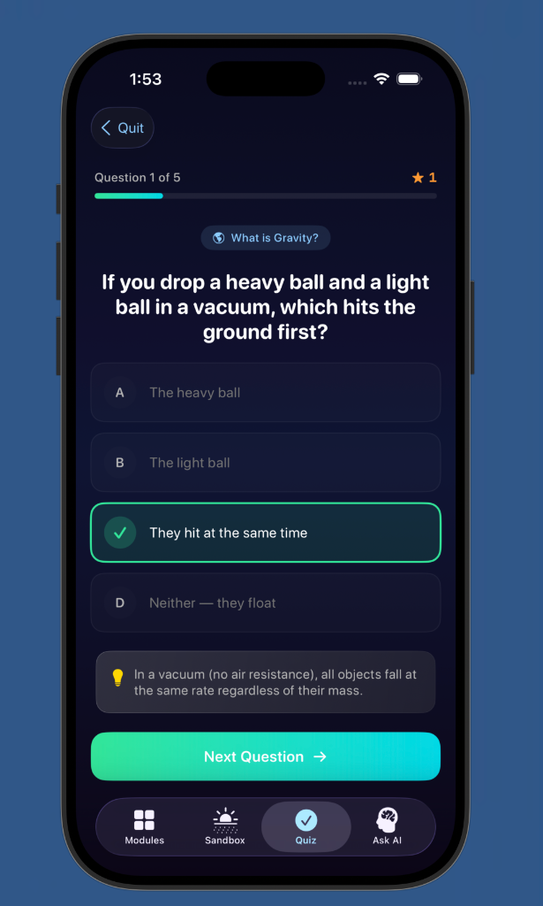
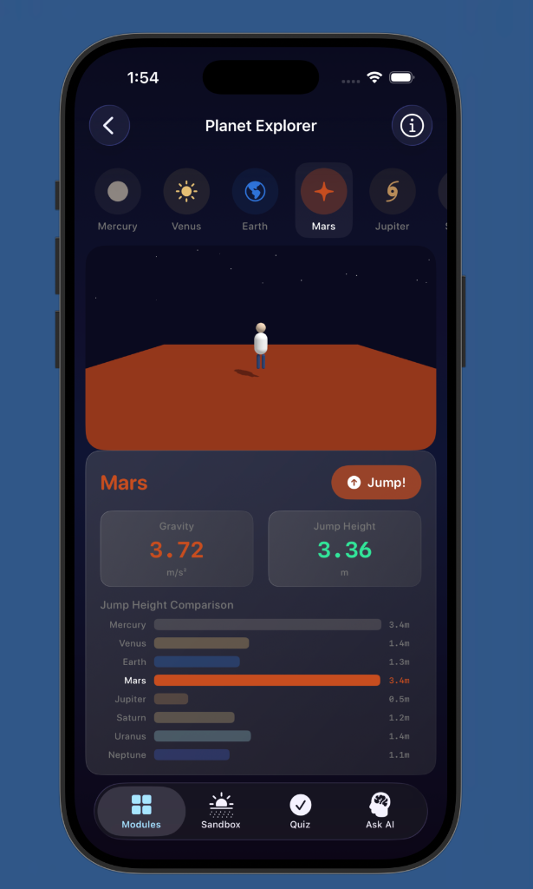
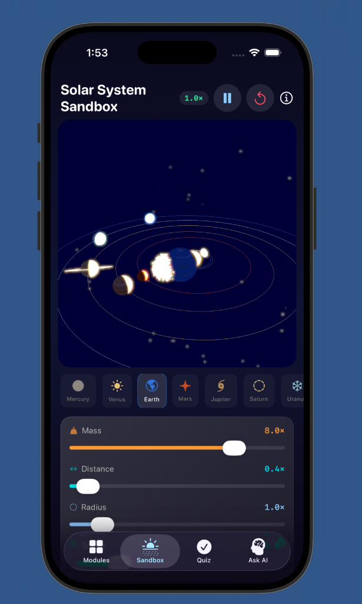
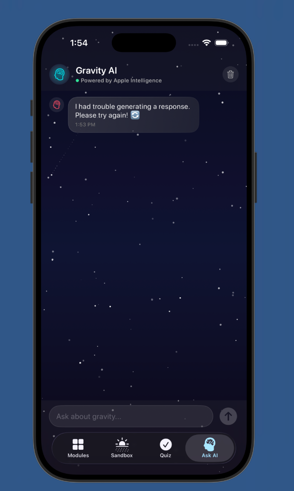

<div align="center">

# 🌌 Gravity Explorer

### *Feel the Force*

**An interactive iOS educational app that teaches gravity through hands-on 3D experiments, real-time physics simulations, and AI-powered learning.**

[](https://swift.org)
[](https://developer.apple.com/ios/)
[](https://developer.apple.com/scenekit/)
[](https://developer.apple.com/apple-intelligence/)

</div>

---

## 📱 Screenshots

<p align="center">
  
  &nbsp;&nbsp;
  
  &nbsp;&nbsp;
  
</p>

<p align="center">
  
  &nbsp;&nbsp;
  
  &nbsp;&nbsp;
  
</p>

---

## 🎬 Demo Video

https://github.com/Baksheeshs/Gravity-_Explorer/raw/main/media/demo.mp4

---

## ✨ Features

### 📚 6 Interactive Modules

| Module | Topic | Experience |
|--------|-------|------------|
| 🌍 **What is Gravity?** | Discover the invisible force | Drop objects on a 3D Earth — adjust gravity from 0 to 30 m/s² |
| ⚖️ **Capital G vs Small g** | Constants & acceleration | Explore universal constant vs local gravitational acceleration |
| ⬇️ **Acceleration** | Free fall experiments | Real-time velocity-time graphs with air resistance toggle |
| 🚀 **Zero Gravity** | Float in space | Experience weightlessness and orbital mechanics |
| 🧍 **Gravity & Body** | Forces on you | Understand normal force, apparent weight, and elevator physics |
| ✨ **Planet Explorer** | Jump across worlds | Compare jump heights on all 8 planets with real data |

### 🪐 3D Solar System Sandbox
> **The crown jewel** — a real-time N-body gravity simulation

- **Velocity-Verlet integration** for accurate orbital mechanics
- **8 planets** with procedurally generated textures
- **Live collision detection** — planets merge with momentum conservation
- **Particle explosion effects** with flash lighting
- **Adjustable parameters** — mass, distance, radius, and simulation speed
- **Saturn's rings**, orbital trails, and HDR bloom effects

### 🤖 Gravity AI Assistant
- Powered by **Apple Intelligence** (Foundation Models)
- Specialized gravity and space physics educator
- Full chat interface with markdown rendering and suggested questions

### 🎯 Quiz System
- **30 multiple-choice questions** (5 per module) with detailed explanations
- Module-specific or comprehensive quiz modes
- Animated quiz cards with instant visual feedback

### 🎵 Procedural Audio Engine
- **Ambient space drone** — real-time sine wave synthesis (55Hz sub-bass + 111Hz overtone with LFO)
- **Collision & merge SFX** — fully synthesized, zero audio file dependencies

### 📳 Haptic Feedback
Custom haptic patterns for every interaction: gravity force, collisions, planet merges, weightlessness, and slider changes.

---

## 🛠 Tech Stack

| Framework | Purpose |
|-----------|---------|
| **SwiftUI** | UI, navigation, state management, animations |
| **SceneKit** | 3D physics simulations and procedural textures |
| **SpriteKit** | Starfield backgrounds with shooting stars |
| **AVFoundation** | Real-time procedural audio synthesis |
| **CoreMotion** | Device motion and acceleration data |
| **FoundationModels** | Apple Intelligence AI assistant |

---

## 🏗 Architecture

```
GravityExplorer/
├── GravityExplorerApp.swift       # @main App entry point
├── Models/
│   ├── GravityRAGEngine.swift     # Apple Intelligence AI engine
│   └── QuizQuestion.swift         # 30 quiz questions + question bank
├── ViewModels/
│   ├── AIChatViewModel.swift      # AI chat state management
│   └── QuizViewModel.swift        # Quiz state machine
├── Views/
│   ├── MainTabView.swift          # 4-tab navigation
│   ├── HomeView.swift             # Module grid with animated header
│   ├── OnboardingView.swift       # 4-page animated onboarding
│   ├── SolarSystemView.swift      # 3D sandbox UI + controls
│   ├── SolarSystemSceneController.swift  # N-body physics engine
│   ├── AI/                        # AI chat interface
│   ├── Quiz/                      # Quiz flow (home, play, results)
│   ├── Components/                # Starfield, ModuleCard, Overlay
│   └── Module1-6/                 # Educational module views
└── Shared/
    ├── Theme.swift                # Design system (colors, fonts, glass)
    ├── AudioManager.swift         # Synthesized audio engine
    ├── HapticManager.swift        # Taptic feedback manager
    ├── MotionManager.swift        # CoreMotion wrapper
    └── Constants.swift            # Planet data, module definitions
```

---

## 🚀 Getting Started

### Requirements
- **iOS 18.0+**
- **Xcode 16+**
- **Swift 6.0**
- iPad or iPhone

### Installation

```bash
git clone https://github.com/Baksheeshs/Gravity-_Explorer.git
cd Gravity-_Explorer
open Package.swift
```

Or open directly in **Swift Playgrounds** on iPad.

---

## 📊 Project Stats

| Metric | Value |
|--------|-------|
| **Swift Files** | 29 |
| **Lines of Code** | 6,753 |
| **Architecture** | MVVM |
| **Quiz Questions** | 30 |
| **Planets Modeled** | 8 |
| **Audio Dependencies** | 0 (fully synthesized) |

---

## 📄 License

MIT License — see [LICENSE](LICENSE) for details.

---

<div align="center">

**Built with ❤️ and Swift**

*Explore. Experiment. Understand.*

</div>
